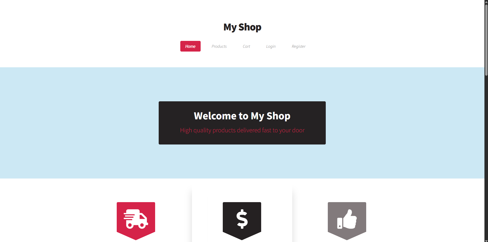

# 🛒 Flask E-commerce Store

A fully functional e-commerce web application built with Flask. This project features user authentication, product management, shopping cart, order processing with Stripe payment integration, and admin panel functionalities.

---

## 📌 Table of Contents

- [🛒 Flask E-commerce Store](#-flask-e-commerce-store)
  - [📌 Table of Contents](#-table-of-contents)
  - [🚀 Features](#-features)
  - [⚙️ How It Works](#️-how-it-works)
  - [🧰 Technologies](#-technologies)
  - [🛠️ Getting Started](#️-getting-started)
    - [1. Clone the repository](#1-clone-the-repository)
    - [2. Setup environment](#2-setup-environment)
    - [3. Run the app](#3-run-the-app)
  - [📂 Project Structure](#-project-structure)
  - [📄 Environment Variables](#-environment-variables)
  - [🎮 Usage](#-usage)
  - [📚 What I Learned](#-what-i-learned)
  - [📄 License](#-license)
  - [👤 Author](#-author)
  - [💬 Feedback](#-feedback)

---

## 🚀 Features

- User registration, login, logout with hashed passwords using Flask-Login
- User profile editing with additional personal data (CPF, RG, address, phone)
- Product catalog with product images, descriptions, prices, and stock quantities
- Shopping cart management with add, remove, update item quantities
- Stripe integration for secure payment processing and checkout
- Order management and history viewing for users
- Admin panel to add, edit, and manage products and orders
- Email notifications for order confirmations
- Validation and security features including CSRF protection and access control



---

## ⚙️ How It Works

- Flask blueprints modularize the app into `auth`, `main`, `cart`, `orders`, `admin`, and `products`
- SQLAlchemy manages database models with relationships for Users, Products, Orders, and Reviews
- WTForms powers user input forms with validation
- Flask-Login handles user session management and login restrictions
- Stripe API creates secure payment checkout sessions and verifies transactions
- Jinja2 templates render dynamic HTML views
- Session storage tracks shopping cart state for each user
- Email module sends order confirmation using configured SMTP credentials

---

## 🧰 Technologies

- Python 3
- Flask web framework
- SQLAlchemy ORM
- Flask-Login for authentication
- WTForms for form handling and validation
- Stripe API for payments
- SQLite for development database (configurable)
- Flask-Mail for email notifications
- Jinja2 templating
- dotenv for environment variable management

---

## 🛠️ Getting Started

### 1. Clone the repository

```bash
git clone https://github.com/CelmarPA/My_Shop_Flask
cd my_shop_flask_project
```

### 2. Setup environment

- Create a `.env` file based on `.env.example` and fill in the required credentials (database URI, mail, Stripe keys, secret key)
- Install dependencies

```bash
pip install -r requirements.txt
```

### 3. Run the app

```bash
flask run
```

---

## 📂 Project Structure

```

my_shop_flash_project/
│
├── app.py                   # Main file to create the Flask app and register blueprints
├── config.py                # Application configuration (Config class)
├── extensions.py            # Global instances (db, login_manager, csrf, mail, etc.)
├── requirements.txt         # Project dependencies
├── .env                     # Environment variables (do not version control)
│
├── models/                  # SQLAlchemy models
│   ├── __init__.py
│   ├── user.py
│   ├── product.py
│   ├── order.py
│
├── forms/                   # WTForms forms
│   ├── __init__.py
│   ├── register_forms.py    # Form for register user
│   └── add_product_form.py  # Form for add product
│   └── edit_product_form.py # Form for edit product
│   └── login_form.py        # Form for login user
│   └── user_data.py         # Form for additional user data
│
├── blueprints/              # Flask blueprints to modularize routes
│   ├── store.db             # SQLite database
│
├── blueprints/              # Flask blueprints to modularize routes
│   ├── __init__.py
│   ├── auth.py              # Blueprint for auth (login, logout, register)
│   ├── main.py              # Blueprint for main routes (home, index)
│   ├── cart.py              # Blueprint for shopping cart
│   ├── orders.py            # Blueprint for user orders and account
│   └── admin.py             # Blueprint for admin panel (if any)
│   └── products.py          # Blueprint for products
│
├── templates/               # Jinja2 templates
│   ├── base.html            # General base template
│   ├── index.html           # Home page
│   ├── login.html
│   ├── register.html
│   ├── cart.html
│   ├── account.html
│   ├── add_product.html
│   ├── admin_orders.html
│   ├── edit_product.html
│   ├── edit_profile.html
│   ├── manage_products.html
│   ├── order_detail.html
│   ├── product_reviews.html
│   ├── review_form_fragment.html
│   ├── success.html
│   ├── cancel.html
│   └── products.html
│
├── static/                  # Static files (assets, product_img, images)
│   ├── assets/
│   ├── product_img/
│   └── images/
│
├── utils/                   # Helpers, validators, etc.
│   ├── __init__.py
│   ├── helpers.py           # Utility functions (e.g. anonymize_name)
│   ├── validators.py        # Custom validators (e.g. admin_required)
│   └── email.py             # Email sending functions
│
```

---

## 📄 Environment Variables

The project uses a `.env` file to securely manage sensitive information such as:

- SECRET_KEY
- DATABASE_URL
- MAIL_SERVER, MAIL_PORT, MAIL_USERNAME, MAIL_PASSWORD
- STRIPE_SECRET_KEY, STRIPE_PUBLIC_KEY

Example `.env` file:

```
SECRET_KEY=your-secret-key
DATABASE_URL=sqlite:///db.sqlite3
MAIL_SERVER=smtp.gmail.com
MAIL_PORT=587
MAIL_USERNAME=your-email@example.com
MAIL_PASSWORD=your-email-password
STRIPE_SECRET_KEY=sk_test_...
STRIPE_PUBLIC_KEY=pk_test_...
```

---

## 🎮 Usage

- Register a new user or login
- Browse products and add them to your cart
- Edit your profile with required details before checkout
- Proceed to checkout and pay with Stripe
- View order history and details in your account panel
- Admin users can add or edit products and manage orders

---

## 📚 What I Learned

- Building modular Flask applications with blueprints
- Managing relational data models with SQLAlchemy
- Secure user authentication and session management
- Integrating third-party payment gateways (Stripe)
- Sending transactional emails with Flask-Mail
- Implementing client-side and server-side validation
- Handling shopping cart state via sessions
- Writing clean, maintainable Python and Flask code

---

## 📄 License

This project is licensed under the **MIT License**.

---

## 👤 Author

**Celmar Pereira de Andrade**

- [GitHub](https://github.com/CelmarPA)
- [LinkedIn](https://linkedin.com/in/celmar-pereira-de-andrade-039830181)
- [Portfolio](https://yourportfolio.com)

---

## 💬 Feedback

Contributions, issues, and suggestions are welcome! Feel free to open an issue or submit a pull request.
